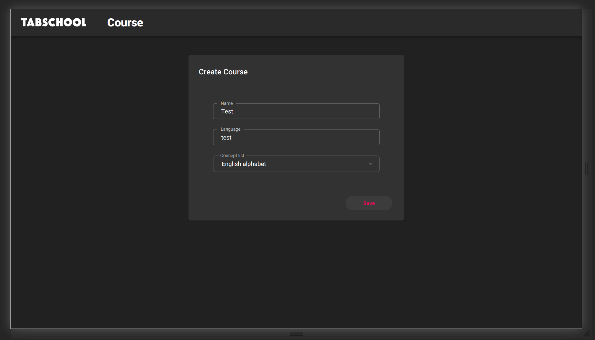
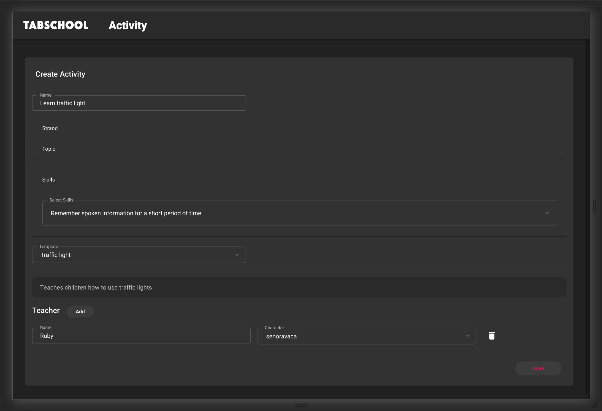

# Create Activity

Now, through a wizard, we will create an activity from the template we just created.
To do this, go to the address */create-course*.

In the course creation form, enter the course name, language, list of concepts. 
In our case, the concepts are not used, but you still have to specify it.

Click **"Save"**.

Then we get to the page for creating an activity for our course.
Enter the name of the activity, strands -> topics -> skills, which the activity trains.
Select the template "Traffic light".

Next to the "Teacher" title, click the "Add" button.
In the form that appears below, enter the name of our virtual teacher and the character from the drop-down list.

Click **"Save"**.

Then we will get to the page for editing the activity.

---

[← Back to index](../../index.md) | [Guide main page](index.md) | [Create dialogs →](dialogs.md)
