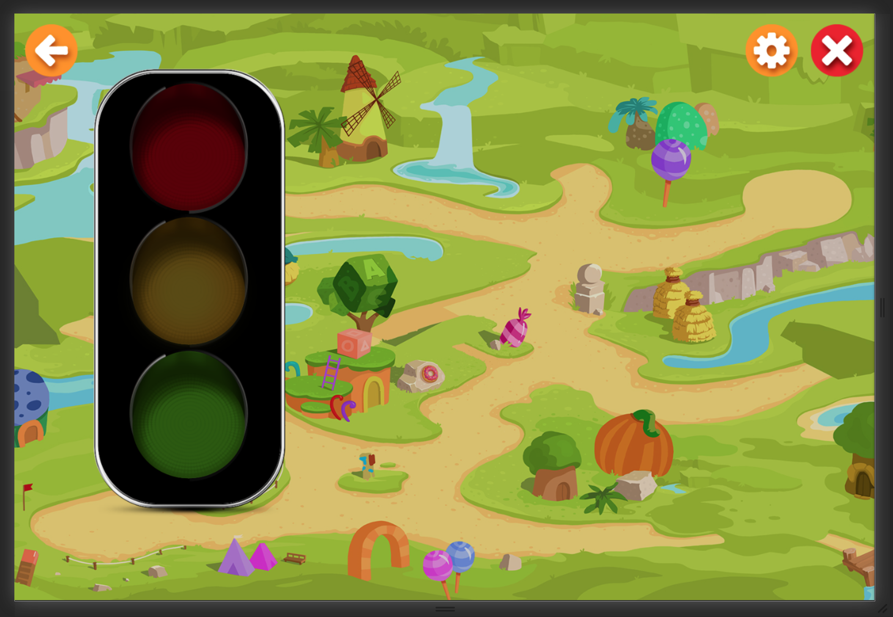

# Create Component

## Run-up

For the of component debugging, it is convenient to prepare a test scene.
To do this, you can take, for example, a Map activity and remove all unnecessary from it, leaving only the basic data set.

If we are working with a Spanish course, then the file path will be `resources/courses/spanish/scenes/map.edn`.

Minimum content will be as follows:

```
{:assets        [{:url "/raw/img/map/background.jpg", :size 10, :type "image"}],
 :objects       {:background {:type "background", :brightness -0.15, :filter "brighten", :src "/raw/img/map/background.jpg"}},
 :scene-objects [["background"]],
 :actions       {:init {:type "sequence-data",
                        :data []}},
 :triggers      {:init {:on "start", :action "init"}},
 :metadata      {:autostart true}}

```

And we will check the result in the browser at `/courses/spanish`.

## Creating component files

To create our component, we need a picture of a traffic light. Put it at `resources/public/images/demo/traffic-light.png`

Create the base component:

`src/cljs/webchange/interpreter/renderer/scene/components/traffic_light/component.cljs`

```
(ns webchange.interpreter.renderer.scene.components.traffic-light.component
  (:require
    [webchange.interpreter.pixi :refer [Container Graphics Sprite]]
    [webchange.interpreter.renderer.scene.components.utils :as utils]
    [webchange.resources.manager :as resources]
    [webchange.interpreter.renderer.scene.components.traffic-light.wrapper :refer [wrap]]))

(def default-props {:x     {}
                    :y     {}
                    :scale {:default {:x 1 :y 1}}})

(defn- create-sprite
  [src {:keys [scale]}]
  (let [resource (resources/get-resource src)]
    (when (-> resource nil?)
      (-> (str "Resources for '" src "' were not loaded") js/Error. throw))
    (doto (Sprite. (.-texture resource))
      (utils/set-scale scale)
      (utils/set-position {:x -380 :y 0}))))

(defn- create-mask
  [{:keys [width height]}]
  (doto (Graphics.)
    (.beginFill 0x000000)
    (.drawRect 0 0 width height)
    (.endFill 0x000000)))

(defn- create-container
  [{:keys [x y]}]
  (doto (Container.)
    (utils/set-position {:x x :y y})))

(def component-type "traffic-light")

(defn create
  [{:keys [parent type object-name] :as props}]
  (let [sprite (create-sprite "/images/demo/traffic-light.png" props)
        mask (create-mask {:width 380 :height 830})
        container (create-container props)]

    (aset sprite "mask" mask)
    (.addChild container sprite)
    (.addChild container mask)
    (.addChild parent container)

    (wrap type object-name container)))

```

And the base wrapper:

`src/cljs/webchange/interpreter/renderer/scene/components/traffic_light/wrapper.cljs`

```
(ns webchange.interpreter.renderer.scene.components.traffic-light.wrapper
  (:require
    [webchange.interpreter.renderer.scene.components.wrapper :refer [create-wrapper]]))

(defn wrap
  [type name container]
  (create-wrapper {:name   name
                   :type   type
                   :object container}))
```

## Add to renderer

Append an entry about our new component to the file `src/cljs/webchange/interpreter/renderer/scene/components/index.cljs`:

```
(ns webchange.interpreter.renderer.scene.components.index
  (:require
    ...
    [webchange.interpreter.renderer.scene.components.video.component :as video]
    [webchange.interpreter.renderer.scene.components.traffic-light.component :as traffic-light]
    ))

(def components (apply hash-map [...
                                 video/component-type {:constructor   video/create
                                                       :default-props video/default-props}
                                 traffic-light/component-type {:constructor   traffic-light/create
                                                               :default-props traffic-light/default-props}]))
```

Also, it must be added to the scene parser:

`src/cljs/webchange/interpreter/object_data/get_object_data.cljs`

```
(defn prepare-object-data
  [name scene-id get-data]
  (let [object (->> (get-data name)
                    (with-navigation-params scene-id name))
        type (-> object :type keyword)
        object-data (case type
                      ...
                      :propagate (-> object
                                     (with-group-params)
                                     (merge {:type        "group"
                                             :object-name (keyword name)})
                                     (filter-extra-props [:el-height :el :width :el-width :height]))
                      :traffic-light (-> object
                                         (assoc :object-name (keyword name))
                                         (with-group-params)
                                         (with-filter-params)
                                         (filter-extra-props [:actions :brightness :filter :highlight :width :height :eager]))
                      (throw (js/Error. (str "Object with type " type " can not be drawn because it is not defined"))))]
    (-> object-data
        (filter-extra-props [:actions :states :scene-name :transition :filter-transition]))))
```

##  Add the component to the test scene

For the sprite image to be loaded, the path to it must be specified in: assets

```
{:assets        [{:url "/raw/img/map/background.jpg", :size 10, :type "image"}
                 {:url "/images/demo/traffic-light.png", :size 10, :type "image"}],
 :objects       {:background {:type "background", :brightness -0.15, :filter "brighten", :src "/raw/img/map/background.jpg"}
                 :tl         {:type "traffic-light"
                              :x    300
                              :y    100}},
 :scene-objects [["background"] ["tl"]],
 :actions       {:init {:type "sequence-data",
                        :data []}},
 :triggers      {:init {:on "start", :action "init"}},
 :metadata      {:autostart true}}
```

As a result, we get an image of a traffic light on the stage:



---

[← Back to index](../../index.md) | [Guide main page](index.md) | [Create action →](action.md)
