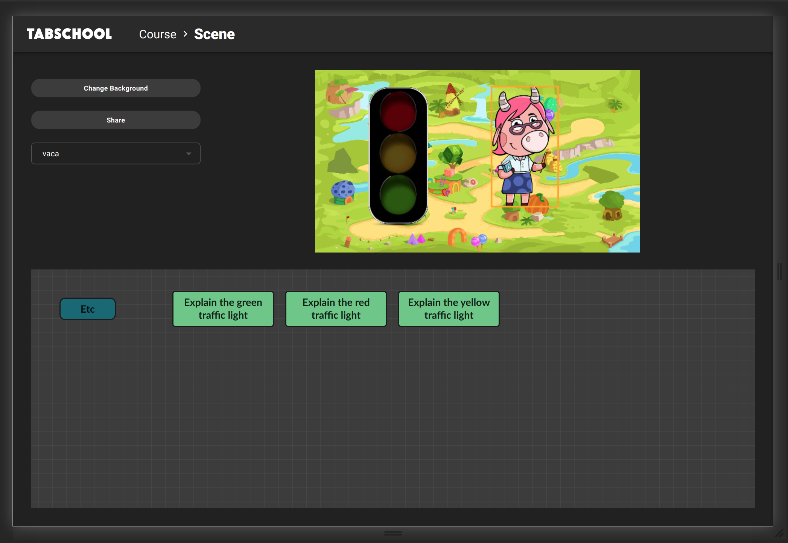
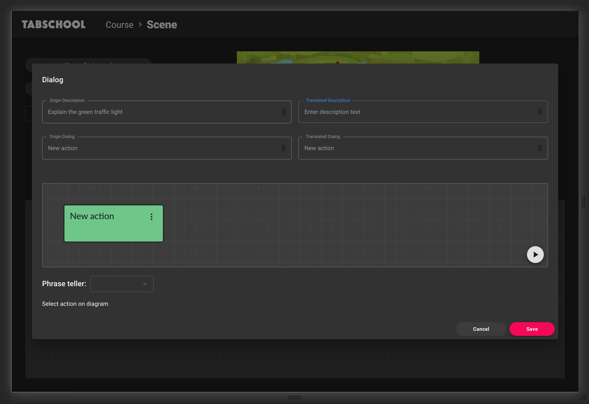
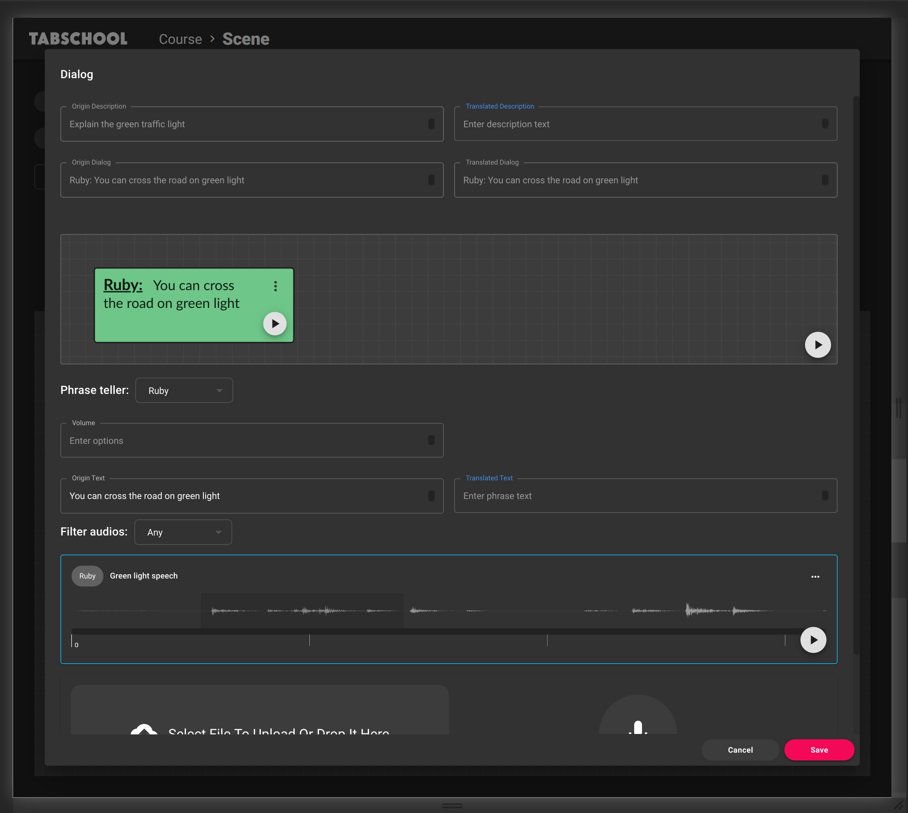
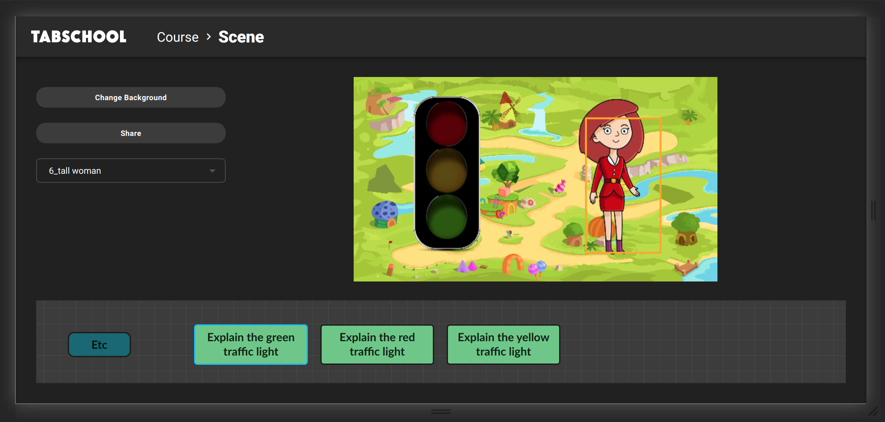

# Create Dialogs

So, we are on the activation edit page.

In the diagram at the bottom of the page, we have 3 green boxes -
per 1 for each action of the dialogue that we created in the template with the field `:editor-type "dialog"`.
If you double-click on the block (e.g.* Explain the green traffic light*),
we get into the window for creating / editing dialog:

Here we click on the block with the text **New action**.
Select our character under the diagram in the **Phrase teller** field.
In the **Origin text** field, enter the text that our character should speak.

Next, download or record audio.
The added audio should appear in the list above the add block.

For further convenience, we can edit audio additional data.
To do this, press the menu button (three dots) in the upper right corner of the list item. Then select Edit data.
Add *"Ruby"* to **Target**, specify **Alias** as *"Green light speech"*. Click a checkmark in the right corner.

After editing, select the audio file range that we need at the moment.
To check the range, you can click on the play button in the lower right corner and listen a piece of audio.

When editing is finished, click the **Save** button.

Similarly, we edit the dialogs for the remaining actions of the activity.

Also on the editing page we can change the background of the scene - press the **Change Background** button.
Or we can change character's skin
by selecting the character on the stage and then selecting the skin in the drop-down list to the left of the stage.

When all changes are complete, you can click the **Share** button
and copy the link to the resulting activity in the window that appears.

---

[← Back to index](../../index.md) | [Guide main page](index.md)
