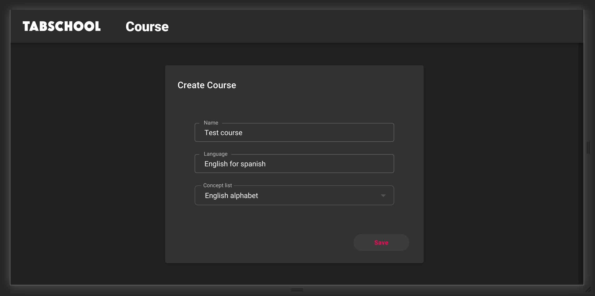
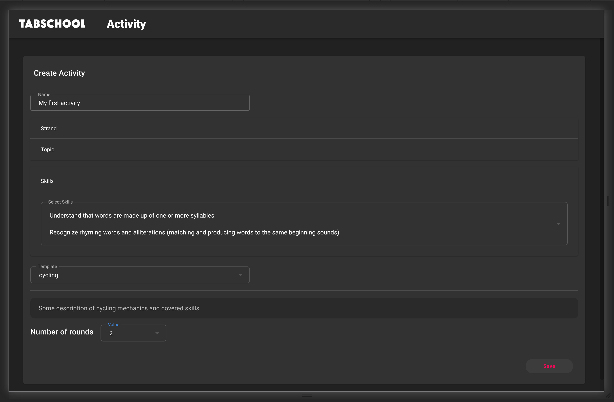
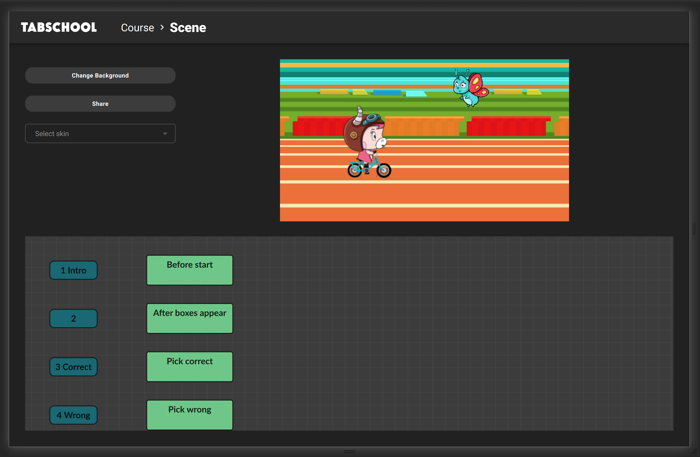

# Create Activity

To create an activity from a template, you first need to create a course..

Go to url `/create-course`

Enter the name of the course, the language, the alphabet that will be used.

Click "Save" button.

Then you will be taken to the page for creating an activity.

Fill in the name of the activity.

You also need to specify the skills that this activity trains. To do this, you must first specify the strands, then the topics. Then choose the skills available in the selected topics.

Next, you need to choose an activity template - one of the standard ones or your own.
More details about templates have been described on the [templates page](create-template.md).
When you select a template, a template form will become available to enter the template options. They also need to be filled in.

Click "Save" button.

Next, you will be taken to the active edit page.

Here you can:
- change activity background
- change character skin
- add / remove / edit dialogs

  Read more about editing dialogs on the [next page](create-dialog.md).

---

[← Back to index](../../index.md)
