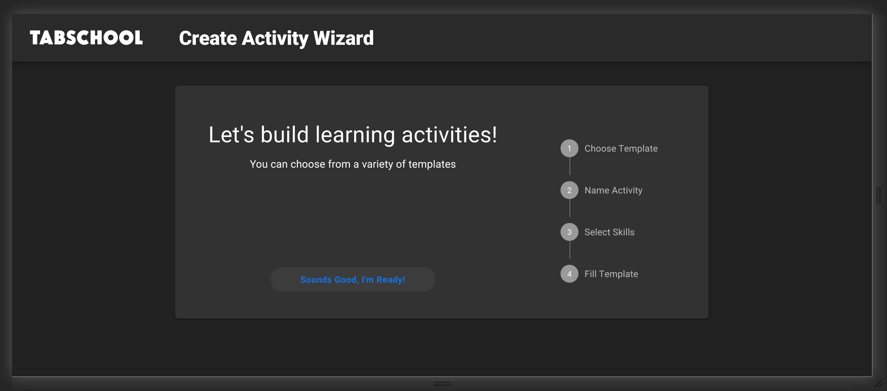

# Create Activity

To create an activity from a template, you need to follow the link `/wizard`.

Here you can see the upcoming steps that you need to go through to create an activity.

At each step, when all the required data is filled in, to proceed to the next step, click "Next".
If you decide to change something at a step already passed, you can return to it by clicking the "Back" button.

To start click the "Sounds good, I'm ready!" button.

### Choose Template

At the first step, you need to choose a template on the basis of which we will create an activity.
For ease of selection, templates can be filtered by tags.
To do this, simply click on the button with the corresponding tag.
More details about templates have been described on the [templates page](create-template.md).

### Name Activity

Next, you need to enter the name of the activity language.
You also need to give the name of the activity and the course to which the activity will belong.

### Select Skills

In the third step, you need to fill in the information about who this activity is intended for.

Choose a level and a subject.

To select the skills to train, you must first select topics. To do this, you first need to select strands.

At the end, choose the group of concepts you need.

### Fill Template

The next step is to fill in the template parameters.

### Finish

When all the steps are completed, you are taken to the last screen of the wizard.
To proceed to filling out dialogs, click the "Edit Dialogs button".

Next, you will be taken to the active edit page.

Here you can:

- change activity background
- change character skin
- add / remove / edit dialogs

Read more about editing dialogs on the [next page](create-dialog.md).

---

[← Back to index](../../index.md)
