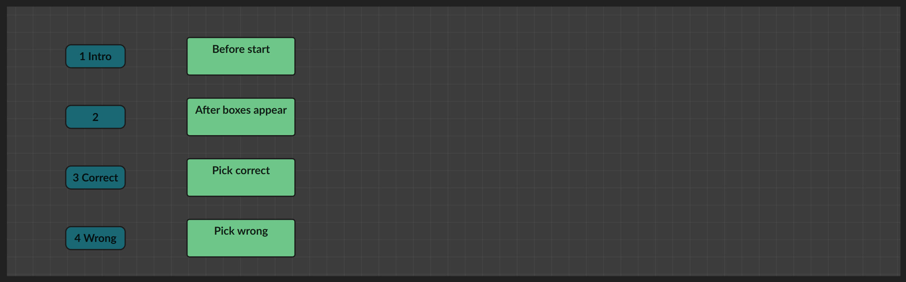
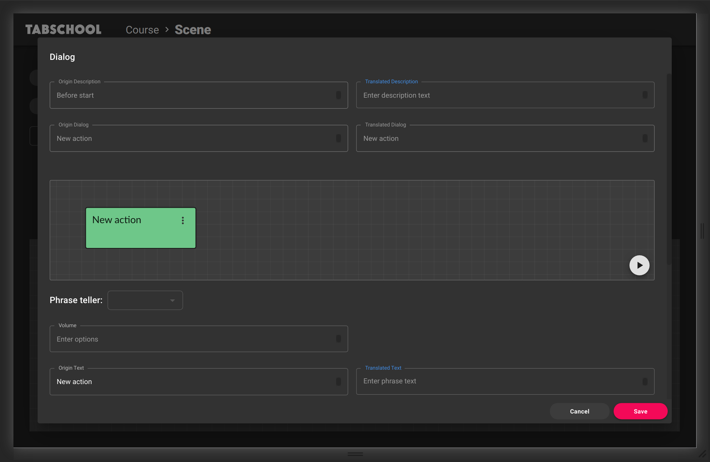
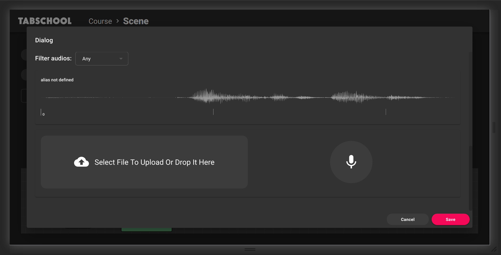
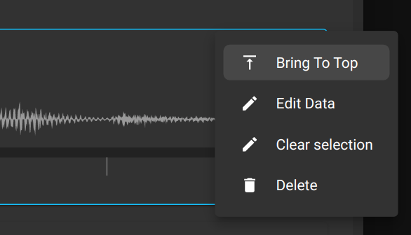
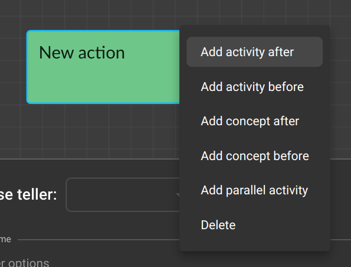

# Create Dialog

On the editor page, at the bottom of the screen, there is a block diagram of the activity dialogs.

Tracks are marked with blue rectangles - auxiliary elements for grouping dialogs.
Tracks are not editable.

Dialogues are marked with green rectangles.
To go to editing the dialog, you need to double-click on the rectangle.

The translation windows have a similar diagram. This time it shows the lines inside the dialogue.

Each block is a separate line of a separate character. An empty dialog appears as one empty line.
By clicking on the line node, you can edit it using the form below:
- select a character from the activity to which the replica belongs (*Phrase teller* drop-down list),
- Set volume (*Volume*),
- Specify line text (*Origin text* и *Translated text*).
  This can improve usability when using the diagram (the text is displayed on the nodes).
  It can also be useful if activity will be translated into other languages.

Below this form is a list of audio files that are used in the activity.

By clicking on an audio track, you can select it for the current line.
Then, you can select the needed audio region with the mouse.

Even below is the form for adding audio -
downloading a file from a computer (left)
or recording audio from a microphone (right).
After adding audio will appear in the list.

Audio tracks have a context menu.

Here you can:
- move the track to the beginning of the list (for ease of use),
- edit target and alias (for subsequent filtering),
- reset selected region
- remove audio

### Adding line blocks

Lines blocks also have their own context menu.

Here you can add blocks before or after the current one.
You can add a block that will be played in parallel with the current one.

You can also choose to add a block common to the current activity or
related to a specific concept (letter of the alphabet).

Don't forget to click the Save button when you're done editing.

---

[← Back to index](../../index.md)
